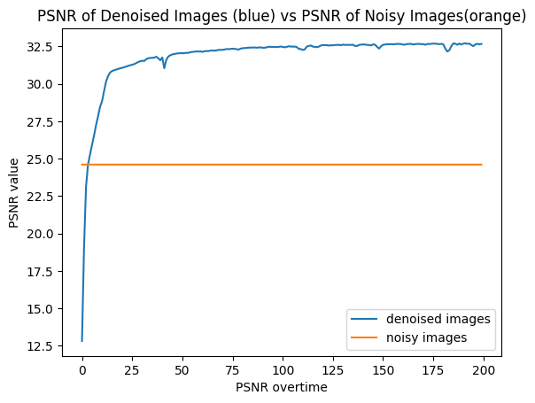
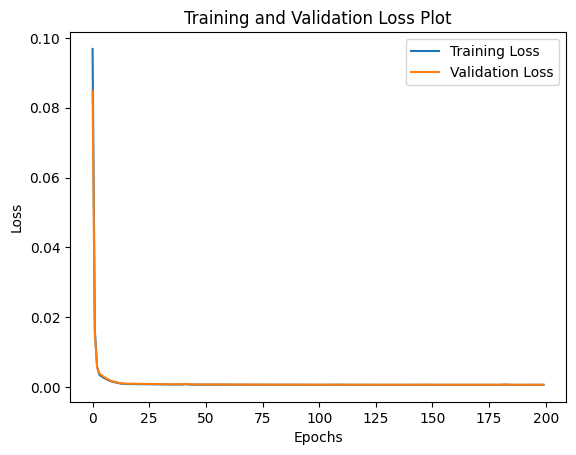
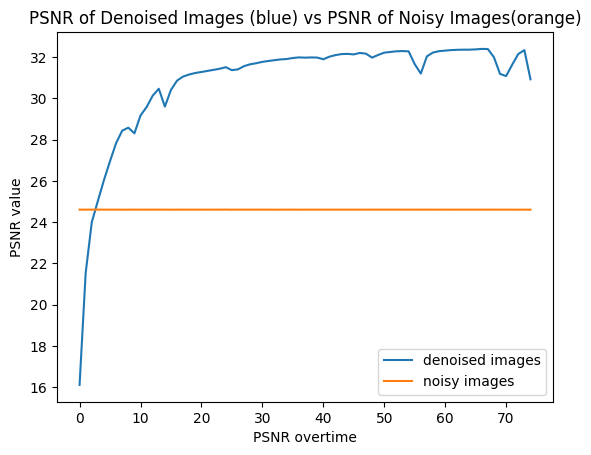
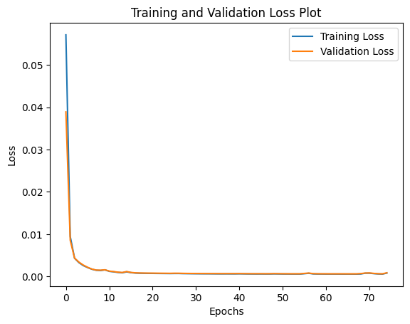

"UnetDenoiserModel.ipynb" is trained on 200 epochs, while the "UnetDenoiserModelEarlyStopping.ipynb" 
is the same model but implementing an early stopping that stopped trainning at 75 epochs. The models used L2 regularization with wieght_decay of 1e-5  
Overall, the model trained without early stopping performs better.  
Model is saved by best psnr, by every 10 epochs, and by the end of trainning. [The saved version can be found on my DropBox](https://wustl.box.com/s/xv0v82jele8qozbi7dnusldottb46rf1).

Without Early Stopping Performance:  

With Early Stopping Performance: 

